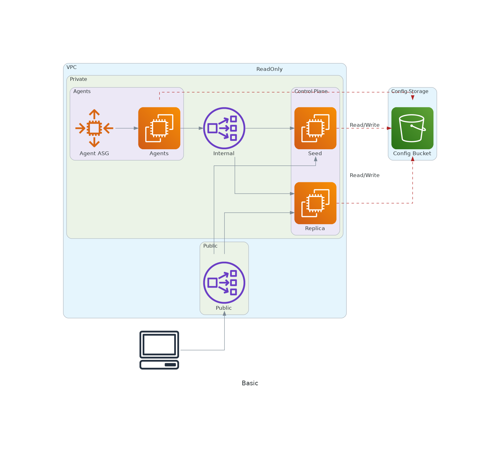
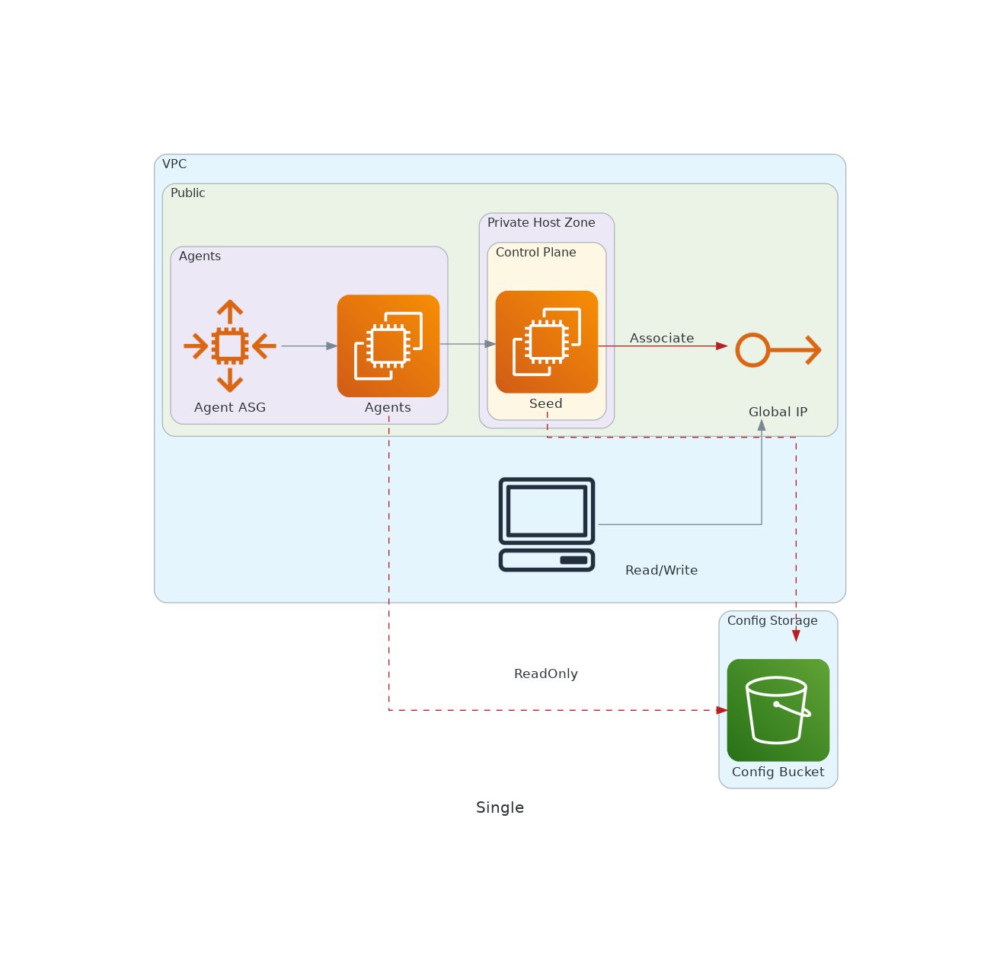

# terraform-aws-rke2
Terraform module to buld a simple RKE2 cluster.
## Basic type
Seed RKE2 server + server replica + Agents + 2NLB

## Single type
Seed RKE2 server + Agents + EIP + Private Domain

## Requirements

| Name | Version |
|------|---------|
|  [terraform](#requirement\_terraform) | >= 1.3 |
|  [aws](#requirement\_aws) | >= 4.40 |
|  [random](#requirement\_random) | >= 3.4.0 |

## Providers

| Name | Version |
|------|---------|
|  [aws](#provider\_aws) | >= 4.40 |
|  [random](#provider\_random) | >= 3.4.0 |

## Modules

| Name | Source | Version |
|------|--------|---------|
|  [agent](#module\_agent) | ./modules/node_pool | n/a |
|  [bucket](#module\_bucket) | ./modules/bucket | n/a |
|  [cluster\_server\_sg](#module\_cluster\_server\_sg) | terraform-aws-modules/security-group/aws | 4.9.0 |
|  [configs](#module\_configs) | ./modules/config | n/a |
|  [control\_plane](#module\_control\_plane) | ./modules/node_pool | n/a |
|  [control\_plane\_seed](#module\_control\_plane\_seed) | ./modules/node_pool | n/a |
|  [inter\_cluster\_sg](#module\_inter\_cluster\_sg) | terraform-aws-modules/security-group/aws | 4.9.0 |
|  [role\_agent](#module\_role\_agent) | ./modules/role | n/a |
|  [role\_control\_plane](#module\_role\_control\_plane) | ./modules/role | n/a |

## Resources

| Name | Type |
|------|------|
| [aws_cloudwatch_event_rule.delete_agent](https://registry.terraform.io/providers/hashicorp/aws/latest/docs/resources/cloudwatch_event_rule) | resource |
| [aws_cloudwatch_event_target.delete_agent_cmd](https://registry.terraform.io/providers/hashicorp/aws/latest/docs/resources/cloudwatch_event_target) | resource |
| [aws_eip.seed](https://registry.terraform.io/providers/hashicorp/aws/latest/docs/resources/eip) | resource |
| [aws_iam_policy.eip_associate_policy](https://registry.terraform.io/providers/hashicorp/aws/latest/docs/resources/iam_policy) | resource |
| [aws_iam_policy.targetgroup_register_policy](https://registry.terraform.io/providers/hashicorp/aws/latest/docs/resources/iam_policy) | resource |
| [aws_iam_role.ssm_run_command_role](https://registry.terraform.io/providers/hashicorp/aws/latest/docs/resources/iam_role) | resource |
| [aws_lb.api_nlb](https://registry.terraform.io/providers/hashicorp/aws/latest/docs/resources/lb) | resource |
| [aws_lb.cluster_nlb](https://registry.terraform.io/providers/hashicorp/aws/latest/docs/resources/lb) | resource |
| [aws_lb_listener.cluster_api](https://registry.terraform.io/providers/hashicorp/aws/latest/docs/resources/lb_listener) | resource |
| [aws_lb_listener.cluster_server](https://registry.terraform.io/providers/hashicorp/aws/latest/docs/resources/lb_listener) | resource |
| [aws_lb_listener.kube_api](https://registry.terraform.io/providers/hashicorp/aws/latest/docs/resources/lb_listener) | resource |
| [aws_lb_target_group.cluster_api](https://registry.terraform.io/providers/hashicorp/aws/latest/docs/resources/lb_target_group) | resource |
| [aws_lb_target_group.cluster_server](https://registry.terraform.io/providers/hashicorp/aws/latest/docs/resources/lb_target_group) | resource |
| [aws_lb_target_group.kube_api](https://registry.terraform.io/providers/hashicorp/aws/latest/docs/resources/lb_target_group) | resource |
| [aws_placement_group.control_plane](https://registry.terraform.io/providers/hashicorp/aws/latest/docs/resources/placement_group) | resource |
| [aws_route53_record.seed](https://registry.terraform.io/providers/hashicorp/aws/latest/docs/resources/route53_record) | resource |
| [aws_route53_zone.private](https://registry.terraform.io/providers/hashicorp/aws/latest/docs/resources/route53_zone) | resource |
| [aws_ssm_document.restart_rke2](https://registry.terraform.io/providers/hashicorp/aws/latest/docs/resources/ssm_document) | resource |
| [aws_ssm_document.restore_rke2](https://registry.terraform.io/providers/hashicorp/aws/latest/docs/resources/ssm_document) | resource |
| [aws_ssm_document.restore_server](https://registry.terraform.io/providers/hashicorp/aws/latest/docs/resources/ssm_document) | resource |
| [random_string.token](https://registry.terraform.io/providers/hashicorp/random/latest/docs/resources/string) | resource |
| [aws_caller_identity.current](https://registry.terraform.io/providers/hashicorp/aws/latest/docs/data-sources/caller_identity) | data source |
| [aws_iam_policy_document.event_bus_role_assume_policy](https://registry.terraform.io/providers/hashicorp/aws/latest/docs/data-sources/iam_policy_document) | data source |
| [aws_iam_policy_document.event_bus_role_policy](https://registry.terraform.io/providers/hashicorp/aws/latest/docs/data-sources/iam_policy_document) | data source |
| [aws_iam_policy_document.seed_eip](https://registry.terraform.io/providers/hashicorp/aws/latest/docs/data-sources/iam_policy_document) | data source |
| [aws_iam_policy_document.targetgroup_register_policy](https://registry.terraform.io/providers/hashicorp/aws/latest/docs/data-sources/iam_policy_document) | data source |
| [aws_region.current](https://registry.terraform.io/providers/hashicorp/aws/latest/docs/data-sources/region) | data source |
| [aws_route53_zone.private](https://registry.terraform.io/providers/hashicorp/aws/latest/docs/data-sources/route53_zone) | data source |
| [aws_vpc.vpc](https://registry.terraform.io/providers/hashicorp/aws/latest/docs/data-sources/vpc) | data source |

## Inputs

| Name | Description | Type | Default | Required |
|------|-------------|------|---------|:--------:|
|  [add\_server\_taint](#input\_add\_server\_taint) | True if add server taint.     Note: The NGINX Ingress and Metrics Server addons will not be deployed     when all nodes are tainted with CriticalAddonsOnly.     If your server nodes are so tainted, these addons will remain pending     until untainted agent nodes are added to the cluster. | `bool` | `false` | no |
|  [agent](#input\_agent) | control plane configurations | <pre>object({     subnet_ids         = list(string)     security_group_ids = list(string)     allocate_public_ip = bool     policy             = optional(map(string), {})     target_group_arns  = optional(list(string), [])     nodepools = list(object({       name             = string       min_size         = optional(number, 1)       max_size         = optional(number, 3)       desired_capacity = optional(number, 3)       instance_types   = optional(list(string), ["t3.medium"])       volume_size      = optional(number, 20)       cpu_credits      = optional(string)        ignore_desired_capacity_changes = optional(bool, true)        instances_distribution = object({         on_demand_base_capacity                  = optional(number)         on_demand_allocation_strategy            = optional(string)         on_demand_percentage_above_base_capacity = optional(number)         spot_allocation_strategy                 = optional(string)         spot_max_price                           = optional(string)       })     }))   })</pre> | n/a | yes |
|  [api\_endpoint\_ip\_white\_list](#input\_api\_endpoint\_ip\_white\_list) | CIDR blocks that can access to control plane | `list(string)` | <pre>[   "0.0.0.0/0" ]</pre> | no |
|  [api\_endpoint\_subnet\_ids](#input\_api\_endpoint\_subnet\_ids) | subnets for loadbalancer to controller kube API | `list(string)` | n/a | yes |
|  [bucket\_name](#input\_bucket\_name) | backupt bucket name | `string` | `""` | no |
|  [cluster\_name](#input\_cluster\_name) | cluster name | `string` | n/a | yes |
|  [control\_plane](#input\_control\_plane) | control plane configurations | <pre>object({     subnet_ids         = list(string)     security_group_ids = list(string)     allocate_public_ip = bool     policy             = optional(map(string), {})     # Single instance uses EIP     single = optional(bool, false)     nodepools = list(object({       # TODO: Allow subnet IDs to be specified.       name                   = string       size                   = number       volume_size            = optional(number, 20)       instance_types         = list(string)       instances_distribution = any       cpu_credits            = optional(string)     }))   })</pre> | n/a | yes |
|  [disabled\_server\_charts](#input\_disabled\_server\_charts) | Specify disabled server charts ammong rke2-canal, rke2-coredns, rke2-ingress-nginx, rke2-metrics-server | `list(string)` | `[]` | no |
|  [extra\_ssh\_keys](#input\_extra\_ssh\_keys) | extra ssh keys | `list(string)` | `[]` | no |
|  [internal\_zone\_id](#input\_internal\_zone\_id) | Private Route53 zone id to register server node(s) when control\_plane.single is true.     Zone sholud be associated with vpc | `string` | `null` | no |
|  [prefix](#input\_prefix) | name prefix | `string` | `""` | no |
|  [rke2\_version](#input\_rke2\_version) | REK2 version like 'v1.20.8+rke2r1' | `string` | `""` | no |
|  [server\_fqdn](#input\_server\_fqdn) | server fqdn | `string` | `""` | no |
|  [ssh\_key\_name](#input\_ssh\_key\_name) | instance ssh key name | `string` | `""` | no |
|  [tags](#input\_tags) | tags | `map(string)` | `{}` | no |
|  [tls\_san](#input\_tls\_san) | tls sans | `list(string)` | `[]` | no |
|  [token](#input\_token) | server token | `string` | `""` | no |
|  [vpc\_id](#input\_vpc\_id) | VPC ID | `string` | `""` | no |

## Outputs

| Name | Description |
|------|-------------|
|  [agent\_autoscaling\_group\_arns](#output\_agent\_autoscaling\_group\_arns) | List of arn of autoscaling group generated |
|  [agent\_autoscaling\_group\_ids](#output\_agent\_autoscaling\_group\_ids) | List of agent's Autoscaling group ID |
|  [ec2\_fleet\_arns](#output\_ec2\_fleet\_arns) | List of arn of ec2 fleet generated |
|  [ec2\_fleet\_ids](#output\_ec2\_fleet\_ids) | List of id of ec2 fleet generated |
